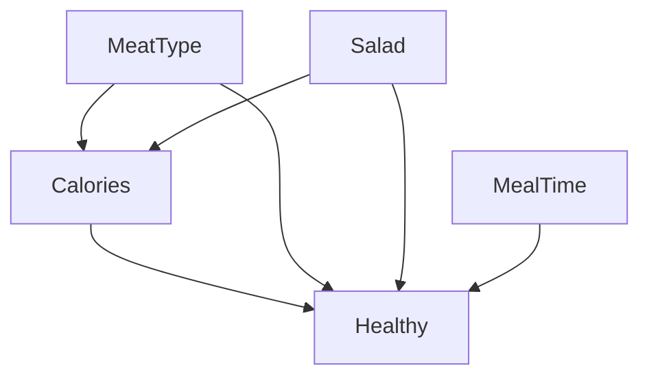

# unknown date

**question**: Describe a local search based approach for learning Bayesian Networks.

answer: hill climbing / local search heuristic

- start with an initial network structure – this could be an empty network (no edges), a naive Bayes structure (all nodes connected to a single parent node), a randomly generated one, one based on prior knowledge, etc.
- choose a metric to evaluate networks
- until convergence to a local optimum:
	- generate neighbors from the current network through local modifications like edge addition, deletion or reversal.
	- score neighbors.

---

**question**: What is overfitting, and when & why is it a problem? Explain measures against overfitting on an algorithm discussed in the lecture.

answer:

- overfitting = poor generalization
	- model performs poorly on unseen data. it has "memorized" the training data rather than learning the underlying patterns
	- high training accuracy, low test accuracy
	- unnecessarily complex, harder to interpret
- measures against overfitting:
	- cross validation
	- pruning (for decision trees)
	- regularization (ie. L1, L2 in polynomial regression)
	- early stopping
	- data augmentation
	- ensemble training with diverse models
	- simplifying model → simpler models are less likely to overfit as they focus on the most relevant aspects of the data.

---

**question**: Suppose you have 5 convolutional kernels of size 7x7 with zero padding and stride 1 in the first layer of a convolutional neural network. You pass an input of dimension 224 x 224 x 3 through this layer. What are the dimensions of the data which the next layer will receive? Explain your answer.

answer:

- $n\times n \circledast f\times f \Rightarrow \left\lfloor\frac{n+2p-f}{s}+1\right\rfloor\times\left\lfloor\frac{n+2p-f}{s}+1\right\rfloor$
- where:
	- $n$ = input = 224 x 224 x 3
	- $f$ = kernel filter = 7 x 7
	- $p$ = padding = 0
	- $s$ = stride = 1
	- num kernels = 5
- result:
	- in this case, since the input image has 3 channels, each of the 5 convolutional kernels has a depth of 3 as well.
	- the 5 convolutional kernels are not applied to separate channels independently. each kernel is applied to the entire input image, which includes all 3 channels - resulting in 5 different outputs each with 3 channels.
	- 5 times: (224 x 224 x 3) $\circledast$ (7 x 7 x 3) = (224 - 7 + 1) x (224 - 7 + 1) x 3 = (218 x 218 x 3)

---

**question**: The following is a very simple classification problem with two classes (y = +1, y = -1), and a total of three training samples:

- $(x_1, y_1)$ = (1, -1)
- $(x_2, y_2)$ = (3, +1)
- $(x_3, y_3)$ = (5, -1)

A Decision Stump classifier, basically a 1-level decision tree, chooses a constant value c on the x-axis and classifies all points where x > c as one class and other points where x ≤ c as the other class. Now consider we want to train a boosting ensemble using Decision stumps on this dataset.

- a) What is the initial weight that is assigned to each data point?
- b) Where would you draw the decision boundary for the first decision stump, and indicate which class would be predicted each side of the decision boundary. Argue your decision.
- b) Which points will have their weights increased after the first iteration.

answer:

- a) initial weights:
	- the question asks about the initial weight assignment and weight updates after each iteration, which is a characteristic of the AdaBoost algorithm. – Gradient Boosting, on the other hand, does not explicitly maintain weights over the training data.
	- in AdaBoost, the initial weight assigned to each data point is typically set to be equal.
	- with three data points, the initial weight for each point would be $\frac{1}{3}$.
- b) optimal decision boundary in decision tree:
	- we choose the "absolute error rate" $\text{err}$ as a metric to find the best split.
	- we only consider boundaries between adjacent data points.
	- results:
		- boundary in \[1;3\[
			- left: -1, right: +1 ⟶ $\text{err}$ = 1
			- left: +1, right: -1 ⟶ $\text{err}$ = 2
		- boundary in \[3;5\[
			- left: -1, right: +1 ⟶ $\text{err}$ = 2
			- left: +1, right: -1 ⟶ $\text{err}$ = 1
	- it's a tie, so we take the first boundary by setting it to $c$ = (1+3)/2 = 2.5
		- if $x_i$ ≤ 2.5 then we predict $y_i$ to be -1
		- if $x_i$ > 2.5 then we predict $y_i$ to be +1
- c) weight increase:
	- the weights of the misclassified points are increased
	- in this case we're missclassifying the datapoint (5, -1) and have to increase it by some factor of choice

---

**question**: Calculate the coefficients $w_0, w_1, w_2$ when using the RSS as a metric. The learning rate $\alpha$ = 0.5. All weights are initialized with 0. What will the second step be?

| $F1$ | $F_2$ | $t$ |
| ---- | ----- | --- |
| 1    | 3     | 12  |
| 2    | 5     | 9   |

answer:

- polynomial regression with hypothesis function: $y = w_0 + w_1 \cdot F_1 + w_2 \cdot F_2$
- 1) initial RSS (residual sum of squares) predictions
	- $\hat{y}_1 = 0 + 0 \cdot 1 + 0 \cdot 3 = 0$
	- $\hat{y}_2 = 0 + 0 \cdot 2 + 0 \cdot 5 = 0$
	- $\text{RSS} = (12-0)^2 + (9-0)^2 = 12^2 + 9^2 = 225$
- 2) calculating the gradients of the RSS for each weight
	- first we simplify the gradient of the RSS:
		- $\frac{\partial \text{RSS}}{\partial w_j} = \frac{\partial}{\partial w_j} \sum_{i=1}^{n} (y_i - \hat{y}_i)^2 = \ldots = \sum_{i=1}^{n} 2 (y_i - \hat{y}_i) \cdot \left(-\frac{\partial \hat{y}_i}{\partial w_j}\right)$
		- $\frac{\partial \hat{y}_i}{\partial w_0} = 1$
		- $\frac{\partial \hat{y}_i}{\partial w_1} = F_{1i}$
		- $\frac{\partial \hat{y}_i}{\partial w_2} = F_{2i}$
		- The -2 factor comes from applying the chain rule to the derivative of the squared term $(y_i - \hat{y}_i)^2$.
	- then we apply the chain rule for each weight:
		- $\frac{\partial \text{RSS}}{\partial w_0} = -2 \sum_{i=1}^{n} (y_i - \hat{y}_i) = -2 \cdot (12 - 0 + 9 - 0) = -42$
		- $\frac{\partial \text{RSS}}{\partial w_1} = -2 \sum_{i=1}^{n} (y_i - \hat{y}_i) \cdot F_{1i} = -2 \cdot ((12 - 0) \cdot 1 + (9 - 0) \cdot 2) = -60$
		- $\frac{\partial \text{RSS}}{\partial w_2} = -2 \sum_{i=1}^{n} (y_i - \hat{y}_i) \cdot F_{2i} = -2 \cdot ((12 - 0) \cdot 3 + (9 - 0) \cdot 5) = -162$
- 3) updating the weights based on the gradients
	- $w_0 \leftarrow w_0 - \alpha \cdot \frac{\partial \text{RSS}}{\partial w_0} = 0 - 0.5 \cdot (-42) = 21$
	- $w_1 \leftarrow w_1 - \alpha \cdot \frac{\partial \text{RSS}}{\partial w_1} = 0 - 0.5 \cdot (-60) = 30$
	- $w_2 \leftarrow w_2 - \alpha \cdot \frac{\partial \text{RSS}}{\partial w_2} = 0 - 0.5 \cdot (-162) = 81$
- 4) repeating until convergence

---

**question**: Explain the goals of automatic classification. Detail how classification differs from other machine learning paradigms.

answer:

- automatic classification = supervised learning
- supervised learning:
	- training data is labeled with the correct class or category (in contrast to unsupervised learning)
	- output variable is categorical or discrete (in contrast to regression)
	- typically evaluated using metrics such as accuracy, precision, recall, F1-score, and confusion matrix, which measure how well the classifier can correctly predict the class labels

---

**question**: Given a Dataset with 7 entries: Using knn(1), calculate the prediction accuracy using the first 6 entries and 2-fold.

| #   | Calories | MeatType | Salad | MealTime | Healthy |
| --- | -------- | -------- | ----- | -------- | ------- |
| 1   | Many     | Cow      | No    | Evening  | No      |
| 2   | Many     | Cow      | Yes   | Noon     | Yes     |
| 3   | Many     | Chicken  | No    | Morning  | No      |
| 4   | Few      | Fish     | Yes   | Evening  | Yes     |
| 5   | Few      | Chicken  | Yes   | Evening  | Yes     |
| 6   | Few      | Fish     | No    | Morning  | No      |
|     | Many     | Fish     | Yes   | Evening  | ?       |

answer:

**step 1**: encoding the categorical variables:

- Calories (ordinal):
	- could have mapped to 0;1 to represent an order - but we're keeping it simple here
	- `Many` = [1, 0]
	- `Few` = [0, 1]
- MeatType (nominal):
	- `Cow` = [1, 0, 0]
	- `Chicken` = [0, 1, 0]
	- `Fish` = [0, 0, 1]
- Salad (nominal):
	- `No` = [1, 0]
	- `Yes` = [0, 1]
- MealTime: (nominal):
	- `Morning` = [1, 0, 0]
	- `Noon` = [0, 1, 0]
	- `Evening` = [0, 0, 1]

| #   | Calories | MeatType         | Salad  | MealTime         | Healthy |
| --- | -------- | ---------------- | ------ | ---------------- | ------- |
| 1   | [1, 0]   | [1, 0, 0]        | [1, 0] | [0, 0, 1]        | 0       |
| 2   | [1, 0]   | [1, 0, 0]        | [0, 1] | [0, 1, 0]        | 1       |
| 3   | [1, 0]   | [0, 1, 0]        | [1, 0] | [1, 0, 0]        | 0       |
| 4   | [0, 1]   | [0, 0, 1]        | [0, 1] | [0, 0, 1]        | 1       |
| 5   | [0, 1]   | [0, 1, 0]        | [0, 1] | [0, 0, 1]        | 1       |
| 6   | [0, 1]   | [0, 0, 1]        | [1, 0] | [1, 0, 0]        | 0       |
|     | [1, 0]   | [0, 0, 1]        | [0, 1] | [0, 0, 1]        | ?       |

| #   | Concatenated Features          | Healthy |
| --- | ------------------------------ | ------- |
| 1   | [1, 0, 1, 0, 0, 1, 0, 0, 0, 1] | 0       |
| 2   | [1, 0, 1, 0, 0, 0, 1, 0, 1, 0] | 1       |
| 3   | [1, 0, 0, 1, 0, 1, 0, 1, 0, 0] | 0       |
| 4   | [0, 1, 0, 0, 1, 0, 1, 0, 0, 1] | 1       |
| 5   | [0, 1, 0, 1, 0, 0, 1, 0, 0, 1] | 1       |
| 6   | [0, 1, 0, 0, 1, 1, 0, 1, 0, 0] | 0       |
|     | [1, 0, 0, 0, 1, 0, 1, 0, 0, 1] | ?       |

**step 2**: two folding data

```
# fold 1: train set / fold 2: test set

[1, 0, 1, 0, 0, 1, 0, 0, 0, 1] -> 0
[1, 0, 1, 0, 0, 0, 1, 0, 1, 0] -> 1
[1, 0, 0, 1, 0, 1, 0, 1, 0, 0] -> 0

# fold 2: train set / fold 1: test set

[0, 1, 0, 0, 1, 0, 1, 0, 0, 1] -> 1
[0, 1, 0, 1, 0, 0, 1, 0, 0, 1] -> 1
[0, 1, 0, 0, 1, 1, 0, 1, 0, 0] -> 0
```

**step 3**: evaluating with knn ($k$ = 1) and measuring accuracy

```
# fold 1

[1, 0, 1, 0, 0, 1, 0, 0, 0, 1]
- Nearest to [1, 0, 1, 0, 0, 1, 0, 0, 0, 1] (Label 0) → Predicted: 0 (True: 0)

[1, 0, 1, 0, 0, 0, 1, 0, 1, 0]
- Nearest to [1, 0, 1, 0, 0, 0, 1, 0, 1, 0] (Label 1) → Predicted: 1 (True: 1)

[1, 0, 0, 1, 0, 1, 0, 1, 0, 0]
Nearest to [1, 0, 0, 1, 0, 1, 0, 1, 0, 0] (Label 0) → Predicted: 0 (True: 0)

Acc: 3/3 (100%)

# fold 2

Sample: [0, 1, 0, 0, 1, 0, 1, 0, 0, 1] -> 1
- Nearest to [0, 1, 0, 0, 1, 0, 1, 0, 0, 1] (Label 1) → Predicted: 1 (True: 1)

Sample: [0, 1, 0, 1, 0, 0, 1, 0, 0, 1]
- Nearest to [0, 1, 0, 1, 0, 0, 1, 0, 0, 1] (Label 1) → Predicted: 1 (True: 1)

Sample: [0, 1, 0, 0, 1, 1, 0, 1, 0, 0]
- Nearest to [0, 1, 0, 0, 1, 1, 0, 1, 0, 0] (Label 0) → Predicted: 0 (True: 0)

Acc: 3/3 (100%)
```

overall accuracy = (accuracy of fold 1 + accuracy of fold 2) / 2 = (1 + 1) / 2 = 1

---

**question**: Classify the missing samples using Naive Bayes.

| Groups | Shifts | Seq2 | DayBlocks | NightB | WorkB | DayOffB | Algorithm |
| ------ | ------ | ---- | --------- | ------ | ----- | ------- | --------- |
| 9      | 3      | NO   | 6         | 3      | 4     | 3       | MC        |
| 9      | 3      | NO   | 4         | 4      | 4     | 3       | MC        |
| 17     | 3      | NO   | 6         | 4      | 4     | 4       | ILS       |
| 13     | 3      | YES  | 5         | 3      | 5     | 4       | ILS       |
| 11     | 3      | YES  | 5         | 3      | 4     | 4       | MC        |
| 7      | 3      | YES  | 5         | 5      | 4     | 4       | MC        |
| 29     | 3      | NO   | 6         | 4      | 4     | 3       | MC        |
| 16     | 3      | NO   | 6         | 4      | 5     | 3       | ILS       |
| 47     | 3      | NO   | 6         | 5      | 6     | 3       | ILS       |
| 27     | 3      | NO   | 6         | 4      | 4     | 3       | ILS       |
| 30     | 3      | NO   | 5         | 3      | 5     | 3       | ILS       |
| 20     | 2      | NO   | 5         | 5      | 4     | 3       | ILS       |
| 24     | 3      | NO   | 5         | 4      | 5     | 3       |           |
| 13     | 3      | YES  | 5         | 3      | 4     | 4       |           |

answer (open question):

- laplace smoothing:
	- $p(x_i = v_j \mid y = c) = \frac{\text{count}(x_i = v_j \text{ and } y = c) + 1}{\text{count}(y = c) + k}$
	- where:
		- $\text{count}(x_i = v_j \text{ and } y = c)$ is the number of times feature $x_i$ takes value $v_j$ in class $c$.
		- $\text{count}(y = c)$ is the number of samples in class $c$.
		- $k$ is the number of possible values that feature $x_i$ can take.
- first prediction:
	- class ILS:
		- $p(\text{Groups} = 24 \mid \text{ILS})$ = 0/7 → (0+1)/(7+12) = 0.0526315789
		- $p(\text{Shifts} = 3 \mid \text{ILS})$ = 6/7 → (6+1)/(7+2) = 0.7777777778
		- $p(\text{Seq2} = \text{NO} \mid \text{ILS})$ = 6/7 → (6+1)/(7+2) = 0.7777777778
		- $p(\text{DayBlocks} = 5 \mid \text{ILS})$ = 2/7 → (2+1)/(7+3) = 0.3
		- $p(\text{NightB} = 4 \mid \text{ILS})$ = 3/7 → (3+1)/(7+3) = 0.4
		- $p(\text{WorkB} = 5 \mid \text{ILS})$ = 3/7 → (3+1)/(7+3) = 0.4
		- $p(\text{DayOFFB} = 3 \mid \text{ILS})$ = 5/7 → (5+1)/(7+2) = 0.6666666667
		- $p(\text{ILS})$ = 7/12 = 0.5833333333
		- $p(\text{ILS} \mid 24, 3, \text{NO}, 5, 4, 5, 3) \propto p(24, 3, \text{NO}, 5, 4, 5, 3 \mid \text{ILS}) \cdot p(\text{ILS})$ = 0.0526315789 · 0.7777777778 · 0.7777777778 · 0.3 · 0.4 · 0.4 · 0.6666666667 · 0.5833333333 = 0.0005943253189 👈 likelier outcome
	- class MC:
		- $p(\text{Groups} = 24 \mid \text{MC})$ = 0/5 → (0+1)/(5+12) = 0.0588235294
		- $p(\text{Shifts} = 3 \mid \text{MC})$ = 5/5 → (5+1)/(5+2) = 0.8571428571
		- $p(\text{Seq2} = \text{NO} \mid \text{MC})$ = 3/5 → (3+1)/(7+2) = 0.4444444444
		- $p(\text{DayBlocks} = 5 \mid \text{MC})$ = 1/5 → (1+1)/(5+3) = 0.25
		- $p(\text{NightB} = 4 \mid \text{MC})$ = 2/5 → (2+1)/(5+3) = 0.375
		- $p(\text{WorkB} = 5 \mid \text{MC})$ = 0/5 → (0+1)/(5+3) = 0.125
		- $p(\text{DayOFFB} = 3 \mid \text{MC})$ = 3/5 → (3+1)/(5+2) = 0.5714285714
		- $p(\text{MC})$ = 5/12 = 0.4166666667
		- $p(\text{MC} \mid 24, 3, \text{NO}, 5, 4, 5, 3) \propto p(24, 3, \text{NO}, 5, 4, 5, 3 \mid \text{MC}) \cdot p(\text{MC})$ = 0.0588235294 · 0.8571428571 · 0.4444444444 · 0.25 · 0.375 · 0.125 · 0.5714285714 · 0.4166666667 = 0.0000625250099
- second prediction:
	- class ILS:
		- $p(\text{Groups} = 13 \mid \text{ILS})$ = 1/7 → (1+1)/(5+12) = 0.1176470588
		- $p(\text{Shifts} = 3 \mid \text{ILS})$ = 6/7 → (6+1)/(7+2) = 0.7777777778
		- $p(\text{Seq2} = \text{YES} \mid \text{ILS})$ = 1/7 → (1+1)/(7+2) = 0.2222222222
		- $p(\text{DayBlocks} = 5 \mid \text{ILS})$ = 2/7 → (2+1)/(7+3) = 0.3
		- $p(\text{NightB} = 3 \mid \text{ILS})$ = 2/7 → (2+1)/(7+3) = 0.3
		- $p(\text{WorkB} = 4 \mid \text{ILS})$ = 3/7 → (3+1)/(7+3) = 0.4
		- $p(\text{DayOFFB} = 4 \mid \text{ILS})$ = 2/7 → (2+1)/(7+2) = 0.3333333333
		- $p(\text{ILS})$ = 7/12 = 0.5833333333
		- $p(\text{ILS} \mid 13, 3, \text{YES}, 5, 3, 4, 4) \propto p(13, 3, \text{YES}, 5, 3, 4, 4 \mid \text{ILS}) \cdot p(ILS)$ = 0.1176470588 · 0.7777777778 · 0.2222222222 · 0.3 · 0.3 · 0.4 · 0.3333333333 · 0.5833333333 = 0.0001423384167 👈 likelier outcome
	- class MC:
		- $p(\text{Groups} = 13 \mid \text{MC})$ = 0/5 → (0+1)/(5+12) = 0.0588235294
		- $p(\text{Shifts} = 3 \mid \text{MC})$ = 5/5 → (5+1)/(5+2) = 0.8571428571
		- $p(\text{Seq2} = \text{YES} \mid \text{MC})$ = 2/5 → (2+1)/(5+2) = 0.4285714286
		- $p(\text{DayBlocks} = 5 \mid \text{MC})$ = 1/5 → (1+1)/(5+3) = 0.25
		- $p(\text{NightB} = 3 \mid \text{MC})$ = 2/5 → (2+1)/(5+3) = 0.375
		- $p(\text{DayOFFB} = 4 \mid \text{MC})$ = 2/5 → (2+1)/(5+2) = 0.4285714286
		- $p(\text{MC})$ = 5/12 = 0.4166666667
		- $p(\text{MC} \mid 13, 3, \text{YES}, 5, 3, 4, 4) \propto p(13, 3, \text{YES}, 5, 3, 4, 4 \mid \text{MC}) \cdot p(MC)$ = 0.0588235294 · 0.8571428571 · 0.4285714286 · 0.25 · 0.375 · 0.125 · 0.4285714286 · 0.4166666667 = 0.0000452189804

---

**question**: Classify the missing samples using 1R

| Groups | Shifts | Seq2 | DayBlocks | NightB | WorkB | DayOffB | Algorithm |     |
| ------ | ------ | ---- | --------- | ------ | ----- | ------- | --------- | --- |
| 9      | 3      | NO   | 6         | 3      | 4     | 3       | MC        |     |
| 9      | 3      | NO   | 4         | 4      | 4     | 3       | MC        |     |
| 17     | 3      | NO   | 6         | 4      | 4     | 4       | ILS       |     |
| 13     | 3      | YES  | 5         | 3      | 5     | 4       | ILS       |     |
| 11     | 3      | YES  | 5         | 3      | 4     | 4       | MC        |     |
| 7      | 3      | YES  | 5         | 5      | 4     | 4       | MC        |     |
| 29     | 3      | NO   | 6         | 4      | 4     | 3       | MC        |     |
| 16     | 3      | NO   | 6         | 4      | 5     | 3       | ILS       |     |
| 47     | 3      | NO   | 6         | 5      | 6     | 3       | ILS       |     |
| 27     | 3      | NO   | 6         | 4      | 4     | 3       | ILS       |     |
| 30     | 3      | NO   | 5         | 3      | 5     | 3       | ILS       |     |
| 20     | 2      | NO   | 5         | 5      | 4     | 3       | ILS       |     |
| 24     | 3      | NO   | 5         | 4      | 5     | 3       |           |     |
| 13     | 3      | YES  | 5         | 3      | 4     | 4       |           |     |

answer:

- we need to identify the single attribute that can best predict the target
- for each feature (dimension), calculate the number of correct predictions it makes on the training data

attribute: Groups

- unique values: {7, 9, 11, 13, 16, 17, 20, 24, 27, 29, 30, 47}
- model:
	- Groups = 9 (MC: 2, ILS: 0) → MC
	- Groups = 11 (MC: 1, ILS: 0) → MC
	- Groups = 13 (MC: 1, ILS: 1) → MC
	- Groups = 7 (MC: 1, ILS: 0) → MC
	- Groups = 29 (MC: 1, ILS: 0) → MC
	- Groups = 17 (MC: 0, ILS: 1) → ILS
	- Groups = 16 (MC: 0, ILS: 1) → ILS
	- Groups = 47 (MC: 0, ILS: 1) → ILS
	- Groups = 27 (MC: 0, ILS: 1) → ILS
	- Groups = 30 (MC: 0, ILS: 1) → ILS
	- Groups = 20 (MC: 0, ILS: 1) → ILS
- evaluation:
	- Predict 9 with MC (2 out of 2 correct)
	- Predict 11 with MC (1 correct)
	- Predict 13 with MC (1 correct)
	- Predict 7 with MC (1 correct)
	- Predict 29 with MC (1 correct)
	- Predict 17 with ILS (1 correct)
	- Predict 16 with ILS (1 correct)
	- Predict 47 with ILS (1 correct)
	- Predict 27 with ILS (1 correct)
	- Predict 30 with ILS (1 correct)
	- Predict 20 with ILS (1 correct)
- accuracy: 12/12

attribute: Seq2

- unique values: {NO, YES}
- model:
	- Seq2 = NO (MC: 4, ILS: 5) → MC
	- Seq2 = YES (MC: 2, ILS: 1) → MC
- evaluation:
	- Predict NO with MC (4 out of 9 correct)
	- Predict YES with MC (2 out of 3 correct)
- accuracy: 6/12

attribute: DayBlocks

- unique values: {4, 5, 6}
- model:
	- DayBlocks = 4 (MC: 1, ILS: 0) → MC
	- DayBlocks = 5 (MC: 3, ILS: 2) → MC
	- DayBlocks = 6 (MC: 2, ILS: 4) → ILS
- evaluation:
	- Predict 4 with MC (1 correct)
	- Predict 5 with MC (3 out of 5 correct)
	- Predict 6 with ILS (4 out of 6 correct)
- accuracy: 8/12

attribute: NightB

- unique values: {3, 4, 5}
- model:
	- NightB = 3 (MC: 3, ILS: 1) → MC
	- NightB = 4 (MC: 1, ILS: 4) → ILS
	- NightB = 5 (MC: 1, ILS: 2) → ILS
- evaluation:
	- Predict 3 with MC (3 out of 4 correct)
	- Predict 4 with ILS (4 out of 5 correct)
	- Predict 5 with ILS (2 out of 3 correct)
- accuracy: 9/12

attribute: WorkB

- unique values: {4, 5, 6}
- model:
	- WorkB = 4 (MC: 4, ILS: 3) → MC
	- WorkB = 5 (MC: 1, ILS: 3) → ILS
	- WorkB = 6 (MC: 0, ILS: 1) → ILS
- evaluation:
	- Predict 4 with MC (4 out of 7 correct)
	- Predict 5 with ILS (3 out of 4 correct)
	- Predict 6 with ILS (1 correct)
- accuracy: 8/12

attribute: DayOffB

- Unique values: {3, 4}
- model:
	- DayOffB = 3 (MC: 4, ILS: 4) → MC
	- DayOffB = 4 (MC: 2, ILS: 2) → MC
- evaluation:
	- Predict 3 with MC (4 out of 8 correct)
	- Predict 4 with MC (2 out of 4 correct)
- accuracy: 6/12

selecting best feature:

- the "Group" feature accuracy of 12/12
- generated rule = `if (Groups = 9 or 11 or 13 or 7 or 29) then Algorithm = MC otherwise Algorithm = ILS

classifying missing samples:

- first test sample: Group = 24 → predicted label: ILS
- second test sample: Group = 13 → predicted label: MC

---

**question**: Describe the difference between bagging and boosting. Describe one algorithm that makes use of bagging.

answer:

- both are ensemble methods where weak learners are combined to create a strong learner
- bagging (bootstrap aggegating):
	- parallel evaluation of independent models
	- using random subsets of the training data
	- constant model weights
	- aggregating the predictions from all models to make a final prediction
	- aims to decrease variance
- boosting:
	- sequential evaluation of models
	- model-weights adjusted based on loss
	- data-weights adjusted based on missclassifications - each model tries to improve previous missclassifications
	- aims to decrease bias
- bagging example: random forest
	- i. train multiple classifiers – through bootstrap sampling
	- ii. combine classifiers – through majority-voting of each classifier
	- iii. evaluate combined classifier – out-of-bag elements for each tree as test-set

---

**question**: Describe random forests in detail + compare to similar algorithms (e.g. 1R and decision trees)

answer:

- random forest:
	- i. train multiple classifiers – through bootstrap sampling
	- ii. combine classifiers – through majority-voting of each classifier
	- iii. evaluate combined classifier – out-of-bag elements for each tree as test-set
- random forest compared to 1-rule and decision tree
	- 1-rule decision trees are decision trees with a depth of 1
	- a decision tree is just one weak lerner in the RF ensemble

---

**question**: difference naive bayesian network to normal (bayesian) network

answer:

- naive bayes is a simple special case of a bayesian network with strong assumptions
- independence assumption:
	- naive bayes assumes that all the features are conditionally independent between features (presence or absence of a particular feature does not depend on the presence or absence of any other feature) given the class variable.
	- general bayesian network captures the conditional dependencies between variables.
- network structure:
	- naive bayes has a single root node

---

**question**: what can be used to create a Bayesian networks? compare it

answer:

- human experts
- learning network structure through local search heuristics: for example hill climb search
	- start with an initial network structure – this could be an empty network (no edges), a naive Bayes structure (all nodes connected to a single parent node), a randomly generated one, one based on prior knowledge, etc.
	- choose a metric to evaluate networks
	- until convergence to a local optimum:
		- generate neighbors from the current network through local modifications like edge addition, deletion or reversal.
		- score neighbors based on goodness-of-fit, log-probability

---

**question**: Propose a Bayesian Network, which you think will be appropriate for this domain (the network should not be a simple Naïve Bayes). Explain shortly why you selected exactly this network

- Calculate some of the conditional probabilities in your network
- Based on your network, classify the last data sample from the table above
- Suppose that node Calories is instantiated. Which nodes of your network would be d-separated in this case?

| #   | Calories | MeatType | Salad | MealTime | Healthy |
| --- | -------- | -------- | ----- | -------- | ------- |
| 1   | Many     | Cow      | No    | Evening  | No      |
| 2   | Many     | Cow      | Yes   | Noon     | Yes     |
| 3   | Many     | Chicken  | No    | Morning  | No      |
| 4   | Few      | Fish     | Yes   | Evening  | Yes     |
| 5   | Few      | Chicken  | Yes   | Evening  | Yes     |
| 6   | Few      | Fish     | No    | Morning  | No      |
|     | Many     | Fish     | Yes   | Evening  | ?       |

answer:




- all features determine whether a meal is healthy
- the ingredients additionally also determine the calories

d-seperation:

- assuming that Calories is instantiated
- MeatType → Calories ← Salad (converging, not d-seperated)
- MeatType → Calories → Healthy (serial, d-seperated)
- Salad → Calories → Healthy (serial, d-seperated)

probabilities:

- P(Calories=Many) = 3/6 = 0.5  
- P(Calories=Few) = 3/6 = 0.5
- P(MeatType=Fish) = 2/6 = 0.33  
- P(MeatType=Chicken) = 2/6 = 0.33  
- P(MeatType=Cow) = 2/6 = 0.33
- P(Salad=Yes) = 3/6 = 0.5  
- P(Salad=No) = 3/6 = 0.5
- P(MealTime=Evening) = 3/6 = 0.5  
- P(MealTime=Noon) = 1/6 = 0.17  
- P(MealTime=Morning) = 2/6 = 0.33
- P(Healthy=Yes) = 3/6 = 0.5
- P(Healthy=No) = 3/6 = 0.5
- P(Calories=Many|MeatType=Fish) = 1/2 = 0.5
- P(Calories=Many|Salad=Yes) = 1/3 = 0.33
- P(Healthy=Yes|Calories=Many) = 1/3 = 0.33  
- P(Healthy=Yes|MeatType=Fish) = 1/2 = 0.5  
- P(Healthy=Yes|Salad=Yes) = 2/3 = 0.67  
- P(Healthy=Yes|MealTime=Evening) = 2/3 = 0.67

labeling the last sample: P(X1, ..., Xn) = Πi P(Xi | Parents(Xi))

- P(Healthy=Yes | Calories=Many, MeatType=Fish, Salad=Yes, MealTime=Evening) ∝ P(Calories=Many | MeatType=Fish, Salad=Yes) · P(MeatType=Fish) · P(Salad=Yes) · P(MealTime=Evening) · P(Healthy=Yes | Calories=Many, MeatType=Fish, Salad=Yes, MealTime=Evening)
- P(Healthy=Yes) = P(MeatType=Fish) * P(Salad=Yes) * P(MealTime=Evening) * P(Calories=Many|MeatType=Fish,Salad=Yes) * P(Healthy=Yes|Calories=Many,MeatType=Fish,Salad=Yes,MealTime=Evening) = 0.33 * 0.5 * 0.5 * 0.5 * 0.67 = **0.028**
- P(Healthy=No) = P(MeatType=Fish) * P(Salad=Yes) * P(MealTime=Evening) * P(Calories=Many|MeatType=Fish,Salad=Yes) * P(Healthy=No|Calories=Many,MeatType=Fish,Salad=Yes,MealTime=Evening)= 0.33 * 0.5 * 0.5 * 0.5 * 0.33 = **0.014**
- conclusion: P(Healthy=Yes) > P(Healthy=No)

---

**question**: Compare SVM with perceptron what is common, what differs

answer:

- SVMs tend to have better generalization performance and can handle more complex datasets, but perceptrons are simpler and faster to train and use.
- perceptron:
	- decision boundary must be linear
	- not guaranteed to find optimal solution
	- iterative, faster to train
	- sensitive to outliers
	- can handle multiclass problems
	- can be easily adapted for online learning
- svm:
	- decision boundary doesn't have to be linear
	- guaranteed to find optimal solution, tries to maximize margin between classes
	- slow inference with non-linear kernels
	- less sensitive to outliers
	- only special variants can handle multiclass problems

**question**: Describe in detail the ideas and concepts of Support Vector Machines; describe all algorithm variations discussed in the lecture

answer:

- kernel trick = increase dimensionality of feature space, to make them linearly seperable by high-dimensional hyperplane
- $K\in\mathbb{R}^{n\times n}$

---

**question**: What re the advantages and disadvantages of SVMs?

answer:

- SVMs are great  high-dimensional data and non-linear classification
- but they can be computationally intensive, sensitive to parameter tuning, hard to interpret

pros:

- effective in high-dimensional spaces
- memory efficient – only use subset of datasets (support vectors) at a time
- versatile with different kernel functions
- effective for non-linear classification using the kernel trick
- good generalization performance and robustness to noise
- can do both classification and regression

cons:

- computationally expensive – not suitable for very large datasets due to quadratic programming optimization and memory requirements
- hard to interpret
- sensitive to choice of of hyperparameters
- less effective when target classes overlap
- primarily designed for binary classification, though can be extended to multi-class problems
- cannot handle missing values well

---

**question**: How do they differ from other classifiers using the basic principle of SVMs?

answer:

- correction: differences between SVMs and other classifiers
- Margin maximization
- Support vectors
- Kernel trick
- Convex optimization
- Sparsity
- Robustness to high dimensions
- Deterministic
- Focus on difficult points near decision boundary

---

**question**: Describe 3 metrics to evaluate classification algorithms and explain how these metrics relate to each other.

answer:

- accuracy
	- $\frac{TP + TN}{TP + FP + TN + FN}$
	- correctness of both positives and negatives
- precision
	- $\frac{TP}{TP + FP}$
	- correctness of positives
- specificity
	- $\frac{TN}{TN + FN}$
	- correctness of negatives
- recall, sensitivity
	- $\frac{TP}{TP + FN}$
	- completeness
- balanced accuracy
	- $\frac{\frac{TP}{TP + FN} + \frac{TN}{TN + FP}}{2}$
	- average of precision and specificity

---

**question**: Explain the importance of statistical significance tests.

answer:

- determining whether observed difference between two systems is by chance (like variations in data or randomness in algorithm)

# 2024-01-23

**(1) question**: Suppose a convolutional neural network is trained on ImageNet dataset. This trained model is then given a completely white image as an input. The output probabilities for this input would be equal for all classes.

answer (boolean): False

- it's extremely unlikely but possible depending on the models architecture
- the probabilities would most likely be closest to the network's learned bias or skewed towards the class with the most uniform features

---

**(2) question**: AdaBoost minimises the residuals of the previous classifier.

answer (boolean): False

- misclassified samples in AdaBoost ≠ residuals of regression in gradient boosting
- adaBoost weighs misclassified samples higher, so the subsequent weak classifiers to pay more attention to those difficult samples.

how adaboost works:

- i. Initially, all training samples are assigned equal weights.
- ii. In each iteration:
	- a weak classifier is trained on the weighted training samples.
	- misclassified samples are given higher weights.
	- the classifier is added to the ensemble with a weight proportional to its accuracy.
- iii. the final prediction is made by taking a weighted majority vote of all the weak classifiers in the ensemble.

---

**(3) question**: Bootstrapping is used when training a Multi-Layer Perceptron.

answer (boolean): False

- bootstrap sampling most common in bagging
- bagging (bootstrap aggregating) = training multiple base models on different bootstrap samples of the training data (ie. random forrest)

---

**(4) question:** Decision trees can handle multi-class problems.

answer (boolean): True

- decision-trees are binary trees but their leafs are not constrained to just two classes

---

**(5) question**: GradientBoosting for classification always starts with the one-rule model.

answer (boolean): False

- gradient-boosting does not necessarily have to start with a decision stump (= decision tree with a single split).
- the initial "one-rule model" can stand for any kind of simple rule-based classifier.

how it gradient boosting works:

- i. start with an initial model $F_0(x)$
	- this can be as simple as predicting the mean of the target values in the case of regression, or the logarithm of the odds for classification.
- ii. for each iteration:
	- compute the "pseudo-residuals", which are the gradients of the loss function, based on the current model's predictions.
	- fit a weak learner (usually a shallow decision tree) to these pseudo-residuals to minimize the residual error.
	- update the model by adding the new weak learner, scaled by a learning rate.
	- $F_m(x) = F_{m-1}(x) + \nu h_m(x)$
	- where:
		- $h_m(x)$ = new weak learner fitted to the pseudo-residuals
		- $\nu$ = learning rate
- iii. the final model is the sum of all the weak learners from each iteration.
- see: https://en.wikipedia.org/wiki/Gradient_boosting#Informal_introduction

---

**(6) question**: In AdaBoost the weights are randomly initialised.

answer (boolean): False

- all training samples are assigned equal weights

---

**(7) question**: PCA is a supervised feature selection method.

answer (boolean): False

- no - principal component analysis is unsupervised
- combines similar (correlated) attributes and creates new one
- assuming we have labels before doing unsupervised feature selection, then they should be hidden

---

**(8) question**: Tree pruning performed after training aims at decreasing the variance of the tree, while it can also decrease its performance on the train set.

answer (boolean): False

- variance = overfitting, predictions are too noisy, not generalizing to test-set
- if a model can generalize better it means that it has better performance on the test-set

---

**(9) question**: Lasso regression cannot be used for feature extraction.

answer (boolean): False

- lasso = least absolute shrinkage and selection operator
- used for feature selection
- used to regularize polynomial regression models
- but it can hypothetically also be indirectly used for feature-extraction by selecting a subset of the features with non-zero coefficients

---

**(10) question**: Model based features used for metalearning are extracted directly from the data set

answer (boolean): False

- model-based features are typically learned from the model itself, not directly extracted from the dataset

---

**(11) question**: Gradient descent is always more efficient than Normal Equation (analytical approach) for linear regression

answer (boolean): False

- a counterexample from the slides: the analytical-solution to linear regression is slower than the iterative-solution through gradient descent
- but in practice it depends on the problem size and for smaller datasets the analytical solution could be faster
- see: https://datascience.stackexchange.com/a/14119/162429

---

**(12) question**: For the Monte Carlo method in reinforcement learning value estimates and policies are only changed on the completion of an episode.

answer (boolean): True

- Monte Carlo methods learn from complete episodes (similar to batches)

---

**(13) question**: The covering algorithm PRISM concentrates on all classes at a time to generate rules.

answer (boolean): False

- prism is a separate-and-conquer algorithm: it tries to find a rule per class at a time
- see: https://katie.cs.mtech.edu/classes/archive/f17/csci446/slides/23%20-%20Learning%20from%20Observations%20-%20Rules.pdf

---

**(14) question**: Suppose that you learned this linear model for the dataset "Regression2Features": $2 + 2 \cdot F_1 + 2 \cdot F_2$

Dataset "Regression2Features":

| $F_1$ | $F_2$ | Target |
| ----- | ----- | ------ |
| 3     | 7     | 13     |
| 5     | 2     | 14     |
| 6     | 2     | 14     |
| 5     | 5     | 17     |

The RMSE of this model in this training set is:

- a) 1.5
- b) 3
- c) 2
- d) None of the above

answer (single choice): None of the above

- predictions:
	- $p_1$ = 2 + 2 · 3 + 2 · 7 = 22
	- $p_2$ = 2 + 2 · 5 + 2 · 2 = 16
	- $p_3$ = 2 + 2 · 6 + 2 · 2 = 18
	- $p_4$ = 2 + 2 · 5 + 2 · 5 = 22
- squared error:
	- $\text{err}_1$ = (22 - 13)^2 = 81
	- $\text{err}_2$ = (16 - 14)^2 = 4
	- $\text{err}_3$ = (18 - 14)^2 = 16
	- $\text{err}_4$ = (22 - 17)^2 = 25
- root mean squared error RMSE: $\sqrt{\sum_i (p_i - a_i)^2 / n}$
	- $\sum_{i} \text{err}_i$ = 81 + 4 + 16 + 25 = 126
	- $n$ = 4
	- RMSE = sqrt(126 / 4) = 5.6124860802

---

**(15) question**: Suppose that you would apply the Naïve Bayes algorithm (without using Laplace correction) in dataset "Random3Features" to predict the class of the last instances based on the first seven training instances. Which class would be predicted for this instance?

Dataset "Random3Features":

| Instance | $F_1$ | $F_2$ | $F_3$ | Class |
| -------- | ----- | ----- | ----- | ----- |
| 1        | a     | y     | k     | –     |
| 2        | c     | y     | s     | –     |
| 3        | a     | y     | k     | +     |
| 4        | b     | n     | k     | –     |
| 5        | b     | y     | s     | +     |
| 6        | a     | n     | s     | +     |
| 7        | b     | n     | s     | –     |
| 8        | a     | n     | s     | ?     |

Options:

- a) –
- b) +
- c) + OR –

answer (single choice): The class $+$ is likelier

- using the bayes theorem with multiple events:
	- $p(A\mid BCD)=\frac{p(BCD\mid A) \cdot  p(A)}{p(BCD)}=\frac{p(B \mid A) \cdot p(C \mid A) \cdot p(D \mid A) \cdot p(A)}{p(BCD)}$
	- see: https://stats.stackexchange.com/questions/417277/bayesian-formula-for-multiple-events/417278#417278
- we want to know:
	- since they both have the same denominator knowing the nominator is sufficient to see which case is likelier
	- $p({+} \mid a, n, s) = \frac{p(a \mid +) \cdot p(n \mid +) \cdot p(s \mid +) \cdot p(+)}{p(a,n,s)} \propto p(a \mid +) \cdot p(n \mid +) \cdot p(s \mid +) \cdot p(+)$
	- $p({-} \mid a, n, s) = \frac{p(a \mid -) \cdot p(n \mid -) \cdot p(s \mid -) \cdot p(-)}{p(a,n,s)} \propto p(a \mid -) \cdot p(n \mid -) \cdot p(s \mid -) \cdot p(-)$
- prior probabilities for each class:
	- $p({+})$ = 3/7
	- $p({-})$ = 4/7
- conditional likelihoods for each feature value given the class:
	- $p(a \mid +)$ = 2/3
	- $p(a \mid -)$ = 1/4
	- $p(n \mid +)$ = 1/3
	- $p(n \mid -)$ = 2/4
	- $p(s \mid +)$ = 2/3
	- $p(s \mid -)$ = 2/4
- posterior probabilities:
	- $p({+} \mid a, n, s) \propto$ 2/3 · 1/3 · 2/3 · 3/7 = 0.0634920635
	- $p({-} \mid a, n, s) \propto$ 1/4 · 2/4 · 2/4 · 4/7 = 0.0357142857
	- meaning $p({+} \mid a, n, s)$ > $p({-} \mid a, n, s)$

---

**(21) question**: Which approaches can help to improve the performance of a neural network?

- a) Get more test data
- b) Use holdout instead of cross-validation
- c) Increase the number of training epochs
- d) Add dropout for testing
- e) Change the learning rate

answer (multiple choice): c and e

- options a, b, d suggest improvements during evaluation and not training
- c) Increase the number of training epochs
	- gives model more time to fit data
	- can help if model is underfitting
- e) Change the learning rate
	- adjusts speed of convergence in gradient descent
	- high learning rate can lead to overshooting, while a low learning rate can cause the model to converge too slowly

--- 

**(22) question**: Which of the following is a data augmentation method?

- a) Image normalisation
- b) SIFT
- c) Max Pooling
- d) Holdout method
- e) Convolution
- f) Cross Validation
- g) All of the above
- h) None of the above

answer (single choice): None of the above

- data augmentation = extend train-set by slightly modifying data (ie. flip, rotate, scale images, …)
- Image normalisation:
	- image processing technique
	- changes the range of pixel intensity values
- scale-invariant feature transform SIFT:
	- image processing technique
	- feature detection algorithm used for extracting features (keypoints, descriptors)
- Max Pooling, Convolution:
	- part of CNN architecture
- Holdout method, Cross Validation:
	- model evaluation technique

---

**(23) question**: Which of the following statements is true for k-NN classifiers?

- a) The classification accuracy is better with larger values of k
- b) The decision boundary is smoother with smaller values of k
- c) The decision boundary is linear
- d) k-NN does not require an explicit training step

answer (single choice): d)

- a) The classification accuracy is better with larger values of k
	- more general and smoother decision boundaries, tendency to underfit
- b) The decision boundary is smoother with smaller values of k
	- more complex and irregular decision boundaries, tendency to overfit
- c) The decision boundary is linear
	- it follows the shape of the data-distribution
- d) k-NN does not require an explicit training step
	- knn is a lazy learner = no training, computation at prediction-step in $O(Nd)$

---

**question**: Consider a k-armed bandit problem with k=5 actions, denoted 1,2,3,4, and 5. Consider applying to this problem a bandit algorithm using epsilon-greedy action selection, sample-average action-value estimates, and initial estimates of Q1(a) = 0, for all a. Suppose the initial sequence of actions and rewards is A1 = 2, R1 = -3 (in the first time step t1 action 2 is selected and the reward for this action is -3), A2 = 1, R2 = 2, A3 = 2, R3 = 2, A4 = 1, R4 = -1, A5 = 2, R5 = 4, A6 = 5, R6 = 3. On some of these time steps the epsilon case may have occurred, causing an action to be selected at random. On which time steps did this definitely occur? On which time steps could this possibly have occurred?

answer (open question): actions taken at $t_3$​, $t_5$​, and $t_6$​ are not greedy actions, indicating random selection might have occurred due to epsilon.

- model:
	- k-bandit algorithm (stationary reward probability distribution), epsilon-greedy action selection, sample-average action-value estimates
	- 5 possible actions
- steps:
	- assume each index $Q[i]$ and $N[i]$ corresponds to action $a_i$
	- take average of rewards observed so far on each update: $Q(A) \leftarrow Q(A) + \frac 1 {N(A)} \cdot \Big[R-Q(A)\Big]$
	- initial:
		- $N = [0, 0, 0, 0, 0]$
		- $Q = [0, 0, 0, 0, 0]$
	- 1st step: action 2 → reward -3
		- $q_2$ = -3/1 = -3
		- $N = [0, 1, 0, 0, 0]$
		- $Q = [0, \text-3, 0, 0, 0]$
	- 2nd step: action 1 → reward 2
		- $q_1$ = 2/1 = 2
		- $N = [1, 1, 0, 0, 0]$
		- $Q = [2, \text-3, 0, 0, 0]$
	- 3rd step: action 2 → reward 2
		- this step wasn't optimal. action 1 had the highest expected value. 👈
		- $q_2$ = (2-3)/2 = -0.5
		- $N = [1, 2, 0, 0, 0]$
		- $Q = [2, \text-0.5, 0, 0, 0]$
	- 4th step: action 1 → reward -1
		- $q_1$ = (2-1)/2 = 0.5
		- $N = [2, 2, 0, 0, 0]$
		- $Q = [0.5, \text-0.5, 0, 0, 0]$
	- 5th step: action 2 → reward 4
		- this step wasn't optimal. action 1 had the highest expected value. 👈
		- $q_2$ = (4+2-3)/3 = 1
		- $N = [2, 3, 0, 0, 0]$
		- $Q = [0.5, 1, 0, 0, 0]$
	- 6th step: action 5 → reward 3
		- this step wasn't optimal. action 2 had the highest expected value. 👈
		- $q_1$ = 3/1 = 3
		- $N = [2, 3, 0, 0, 1]$
		- $Q = [0.5, 1, 0, 0, 1]$
- see: https://stats.stackexchange.com/questions/316911/how-to-understand-k-armed-bandit-example-from-suttons-rl-book-chapter-2 
- see: https://github.com/Sagarnandeshwar/Bandit_Algorithms

# 2019-10-18

**question**: Random forests heterogenous ensemble learner?

answer: False

- it's homogenous because the decision-tree is the only used model

---

**question**: Perceptron with Softmax solves XOR-Problem

answer: False

- perceptron is a linear seperator - the xor function we want to fit is not linearly seperable
- the softmax activation function just returns predicted probabilities for each output class

---

**question**: D-Separation used in neighbourhood searches in a Bayes net

answer: True

- d-separation tells us whether two nodes are conditionally independent given the evidence
- it can serve to reduce the search space, but it isn't necessary

---

**question**: Paired t-tests used for folds verification in holdout method (train/test split)

answer: True

- note: the folds meant here are the train/test splits in the holdout method
- paired t-tests are designed for comparing different model performances
- we can't compare the same model on different folds
- use-cases:
	- comparing different models
	- comparing the same model with different hyperparameters, data preprocessing techniques
	- comparing different cross-validation strategies (ie. k-fold vs. leave-one-out) → helps considering data variability introduced by the different data folds

---

**question**: Is information gain a method for unsupervised feature selection?

answer: False

- information gain is a supervised method because we're measuring can predict the target variable with the input features

---

**question**: Is Bayesian optimization used for construction Bayesian networks?

answer: False

- i assume that what's meant here is bayesian optimization BO as a type of SMBO
- BO optimizes hyperparameters, not network structures

---

**question**: SVM: Does the SOM (?) method/algorithm guarantee convergence to globally optimal solution?

answer: False

- correction: does the sequential minimal optimization SMO algorithm guarantuee that SVMs converge to the globally optimal solution?
- SMO = designed to solve the quadratic programming problem in SVMs
	- iterative algorithm
	- updates lagrange multipliers to minimize the quadratic programming (QP) problem
	- in some scenarios with non-strict convexity, it doesn't find the global optimum.
	- see: https://en.wikipedia.org/wiki/Sequential_minimal_optimization

---

**question**: Explain Rice's framework for algorithm selection. Can it be used for Bayesian optimization of hyperparameters?

answer: True

- correction: can rice's model of the algorithm selection problem also be used for the sequential model-based bayesian-optimization (smbo) algorithm, specifically bayesian optimization?
- yes – we can use rice's framework to find the optimal model for optimizing hyperparameters
- rice's model:
	- for a given problem instance $x \in P$ with features $f(x) \in F$ find the selection mapping $S(f(x))$ into algorithm space, such that the selected algorithm $a \in A$ maximizes the performance mapping $y(a(x)) \in Y$
	- i. feature extraction:
		- $x \in P \mapsto f(x) \in F$
		- $x$ = dataset from problem-space $P$
		- $f$ = extracted features from feature-space $F$
		- we assume that we can access a subset $P'$ of the universe $P$
		- the dataset $x$ contains features $f(x)$, but we also have to add labels $t(x)$
	- ii. algorithm selection:
		- $S: f(x) \mapsto \alpha \in A$
		- $\alpha$ = algorithms that can solve the problem in algorithm-space $A$
	- iii. performance measurement:
		- $\alpha(x) \mapsto y \in Y$
		- $y$ = performance metrics in performance-metric space
		- next select another algorithm and repeat
- adapted to bayesian optimization:
	- problem space $X$ = all possible black-box functions to be optimized
	- algorithm apace $A$ = the different selection functions used to select the next point to evaluate.
	- performance measure $P$ = the performance of the SMBO algorithm, typically measured by how quickly it finds a near-optimal solution.

# 2019-06-27

**question**: Perceptron with Softmax solves XOR-Problem

answer: False

- linear decision boundary - doesn't converge for xor function

---

**question**: Lazy learners good for big data

answer: False

- lazy learner = no training, computation at prediction-step $O(Nd)$
- this makes it inefficient on large datasets (even with a variety of optimizations to reduce the runtime)
- but they're useful for online learning systems where you don’t want to retrain your model on each new datapoint

---

**question**: D-Separation used in neighbourhood searches in a Bayes net

answer: True

- d-separation tells us whether two nodes are conditionally independent given the evidence
- it can serve to reduce the search space, but it isn't necessary

---

**question**: Naive Bayes, Lapace correction must be used

answer: True

- zero probability when a feature is not present in the training data
- the laplace correction ensures that the multiplication of probabilities do not become zero

---

**question**: Paired T-tests used at folds verification?

answer: True

- note: the folds meant here are the train/test splits in the holdout method
- paired t-tests are designed for comparing different model performances
- we can't compare the same model on different folds
- use-cases:
	- comparing different models
	- comparing the same model with different hyperparameters, data preprocessing techniques
	- comparing different cross-validation strategies (ie. k-fold vs. leave-one-out) → helps considering data variability introduced by the different data folds

---

**question**: Decision Tree: $k$ features $\gg$ $N$ samples

- a) If all features are binary: how many leaves can you have? how deep can the tree be?
- b) If all features are continuous: how many leaves can you have? how deep can the tree be?

answer:

- the maximum number of leaves in the tree is reached when every possible combination of feature values is represented by a leaf.
- the depth of the tree is determined by the maximum number of splits from the root to a leaf.
- a) binary features only
	- max leaves = $\min(2^k, N)$
		- on each split the number of branches can double
		- but the actual number of leaves can be at most $N$ as there can't be more leaves than samples
	- max depth = $\log_2(2^k) = k$
		- on each split we halve the feature space
	- but since there cant be more leaves $k \gg N$:
- b) continuous features only
	- max leaves = $N$
		- each split can potentially infinitely divide the dataset, but practically, the maximum number of splits will be constrained by the number of samples
	- max depth = $N$
		- In the worst-case scenario, the tree could also split multiple times on the same feature due to the continuous values
		- but the tree can't have more levels than there are samples to split

---

**question**: Describe gradient descent in linear regression

answer:

- i. initialize weights: $w_0, w_1$
- ii. define the loss function (ie. sum of squares rss)
- iii. until convergence of error, for each training example $(x, y)$ subtract the gradients of the loss function in regard to each weight $\frac{\partial L(w_0,w_1)}{\partial w_0}$, $\frac{\partial L(w_0,w_1)}{\partial w_1}$ multiplied by the learning rate $\alpha$ from the weights.

---

**question**: Describe optimization of hyper parameters with Bayes optimization

answer:

- loss function for hyperparams:
	- $f(\boldsymbol{\lambda})=\frac{1}{k}\sum_{i=1}^{k}{L} (A_{\boldsymbol{\lambda}}, {D}_{\mathrm{train}}^{(i)}, {D}_{\mathrm{valid}}^{(i)})$
	- where:
		- $A_\lambda$ = algorithm configured with hyperparam $\lambda$
		- $\mathbf \Lambda = \Lambda_1 \times \dots \times \Lambda_n$ = hyperparam-space from different domains
- sequential model-based bayesian-optimization (smbo):
	- probabilistic regression model with loss function
	- uses information from past trials to inform the next set of hyperparameters to explore
	- useful for optimizing computationally expensive models
	- objective function = function that takes in hyperparameters and outputs a score to be minimized or maximized.
	- surrogate model = model that approximates the objective function based on past observations, so it's faster than direct measurement.
	- selection function = criteria used to evaluate which hyperparameters to choose next from the surrogate model. balances exploration and exploitation.
	- history = collection of (score, hyperparameter) pairs used to update the surrogate model.
	- variants:
		- bayesian optimization (BO): uses a gaussian process (GP) as the surrogate model
		- tree parzen estimator (TPE): multiple separate models
	- steps:
		- i. initial surrogate model – fit a surrogate model to the initial set of observations.
		- ii. selection – use the selection function to determine the next set of hyperparameters to evaluate.
		- iii. evaluation – evaluate the objective function at the selected hyperparameters.
		- iv. update – update the surrogate model with the new observations.
		- repeat until convergence
- see: https://towardsdatascience.com/bayesian-optimization-concept-explained-in-layman-terms-1d2bcdeaf12f

# 2018-01-26

**question**: when k-nn is used with 1-n encoding, min-max scaling is needed to perform euclidian distance

answer: True

- it's not required but recommended
- definitions:
	- euclidian distance: $d(\mathbf d, \mathbf p) = \sqrt{\sum_{i=1}^n (q_i - p_i)^2}$
	- 1-hot-encoding = zero array with 1 bit flag for category
	- min-max scaling = mapping to new range, typically 0;1
- reasoning:
	- after encoding the categorical features, you should normalize or scale all features.
	- normalizing or scaling all features ensures that they contribute equally to the distance calculations and won't skew the results by their scale or representation.

---

**question**: backpropagation is a technique used with perceptrons (single layer)

answer: False

- you can't backprop if you don't have any previous layeres to apply the gradient chain-rule on

---

**question**: pruning is needed for underfitting

answer: False

- pruning improves generalizability

---

**question**: k-nn is recommended for large datasets

answer: False

- lazy learner = no training, computation at prediction-step $O(Nd)$
- this makes it inefficient on large datasets (even with a variety of optimizations to reduce the runtime)

---

**question**: paired t-tests are used when dealing with train/test splits

answer: True

- note: this question is referring to the holdout method
- paired t-tests are designed for comparing different model performances
- we can't compare the same model on different folds
- use-cases:
	- comparing different models
	- comparing the same model with different hyperparameters, data preprocessing techniques
	- comparing different cross-validation strategies (ie. k-fold vs. leave-one-out) → helps considering data variability introduced by the different data folds

---

**question**: for k-nn categorical features should be normalized

answer: True

- correction: categorical features should be Z-score normalized after one-hot-encoding if you want to compute a distance in models such as knn.
- categorical features should be one-hot encoded but not normalized post encoding.
- normalizing them will destroy their meaning, as they are binary flags.

---

**question**: difference between z-score and min-max, when to use which on which feature types

answer: 

- Z-score normalization:
	- transforms the data to have a mean of 0 and a standard deviation of 1.
	- keeps relative scale (range)
	- doesn't keep the distribution
	- can deal with positive and negative numbers.
	- use-cases:
		- algorithms that assume gaussian distributed data, like PCA or LD
- min-max normalization:
	- maps the data to a different range, typically 0;1.
	- doesn't keep relative scale (range)
	- keeps distribution
	- outliers can skew the range.
	- use-cases:
		- algorithms that need a certain range like neural networksn
- see: https://stats.stackexchange.com/questions/547446/z-score-vs-min-max-normalization

---

**question**: difference naive bayesian network to normal network

answer:

- difference naive bayesian network to neural network
- a bayesian network is a type of graph:
	- directed acyclic graph
	- nodes = represents a random variable
	- edges = probabilistic dependencies
	- each node has a conditional-probability-table with incoming edges as columns (ancestors being true/false) and their corresponding output probabilities
- neural networks are a type of graph:
	- doesn't have to be acyclic - nodes can have self-referencing edges (but during backprop these self-references are unrolled)
	- can approximate functions by composing different parts of the activation function in each layer
	- nodes = represent neurons, have an activation function based on all incoming edges
	- edges = show order of function compositions

---

**question**: difference gradient descent and normal equation. which would you use on a lin. reg. example

answer: 

- (based on the slides) the analytical-solution to linear regression is slower than the iterative-solution through gradient descent
- but in practice it depends on the problem size and for smaller datasets the analytical solution could be faster
- gradient descent pros:
	- versatility – can be also used for non-linear models
	- simplicity – with iterative method there is no need for matrix conversion
	- efficiency – for larger datasets (the analytical method is faster for smaller datasets)
- gradient descent cons:
	- sensitivity to learning rate – it may either converge too slowly or overshoot
	- susceptibility to local minima – it's not guaranteed to converge to a global minimum / find the optimal solution
	- noisy updates – might have lots of redundant computations and oscilate
	- sensitivity to feature scaling – features with different scales influence performance
---

**question**: name some model based attributes in meta learning

answer: 

- model-based attributes (meta-features) are measures obtained from a fitted model
- they don't incorporate or rely on any performance metrics
- examples:
	- model architecture (ie. convolutional, recurrent, or fully connected)
	- initialization strategy
	- regularization techniques
	- optimization algorithm (ie. stochastic gradient descent SGD, Adam)
	- learning rate scheduling (how learning rate is updated)
	- loss function

# 2017-06-14

**question**: Entropy max when all elements from same class?

answer (boolean): False

- the entropy is minimized when all elements belong to the same class, and it is maximized when the elements are evenly distributed among all classes.
- proof:
	- $H(X) = - \sum_{i = 1}^n p(x_i) \cdot \log_{2}(p(x_i))$
	- where:
		- $p(x_i)$ = probability of a dataset having the label $i$
	- assuming there is just one label, then: $\forall i: p(x_i) = 1$ and $n=1$
	- therefore: $H(X) = - \sum_{i = 1}^1 1 \cdot \log_{2}(1) = -1 \cdot 0 = 0$

---

**question**: RF heterogeneous ensemble learner?

answer (boolean): False

- it's homogenous because the decision-tree is the only used model

---

**question**: PCA supervised feature selection method?

answer (boolean): False

- principal component analysis is unsupervised

---

**question**: McNemar's Test is used for significance testing?

answer (boolean): Yes

- it helps determine if an event or intervention caused a significant shift in some characteristic within the same group of people, by comparing how many people changed their characteristic in one direction versus the other direction.

---

**question**: Z-scaling vs. min/max scaling.

answer:

- min/max-scaling (normalization)
	- transforms data to a specified range, typically between 0 and 1
	- $X_{\text{normalized}} = \frac{X - X_{min}}{X_{max} - X_{min}}$
- Z-scaling (standardization)
	- transforms data to have a mean of 0 and a std dev of 1
	- $X_{\text{standard}} = \frac{X - \mu}{\sigma}$
- see: https://kharshit.github.io/blog/2018/03/23/scaling-vs-normalization

---

**question**: Draw an Bayes Net with 5-7 Nodes. Include serial, diverging, and converging connection. D-separation?

answer:

- transmission of evidence:
	- d-seperated / blocked = we can't transmit evidence (conditional independence)
	- d-connected / connected = we can transmit evidence
	- the rules below must apply to all possible paths between A, C
	- there must be at least one intermediate node
	- in the serial case we can differentiate between forward-serial and backward-serial
	- in the converging case, if B or any of its descendants are observed we can "explain away"
- connection types:
	- serial: A → B → C
		- A → C transmission blocked if we know B
	- diverging: A ← B → C
		- A ←→ C transmission blocked if we know B
	- converging: A → B ← C
		- A ←→ C transmission blocked if we don't know B or any of it's descendants


---

**question**: Gradient Descent pseudo code.

answer:

```
Initialize weights (w) randomly
Define a learning rate (α)
Define a maximum number of iterations (max_iter)

Initialize weights θ randomly

for iter = 1 to max_iter:
    # Forward Propagation
    Compute the predicted output (y_pred) using the current weights

    # Compute the cost function
    Compute the cost (J) using the predicted output and true output

    # Backward Propagation
    Compute the gradients of the cost function with respect to weights (dJ/dw)

    # Update the weights
    w = w - α * (dJ/dw)

return w
```

# 2017-03-17

**question**: Random Forests. What makes a RF random?

answer:

- ensemble learning method
- de-correlated decision-trees used as models
- steps:
	- i. random sampling of data
		- bagging or bootstrap aggregating
		- some samples may appear multiple times in a given subset while others may not appear at all
	- ii. random feature selection
		- random subset of features chosen to decide split
	- iii. prediction, evaluation
		- averaging the predictions (regression) or taking a majority vote (classification)
		- evaluated with unused samples (out-of-bag elements) for each tree as test-set

---

**question**: What is Feature Selection? Name methods of Feature Selection

answer:

- dimensionality reduction = select subset of features to reduce redundance, noise
- supervised types:
	- a) wrapper
		- = evaluate models trained with feature subsets – search through all possible subsets.
		- forward selection – greedy search, starting with no features and progressively adding features
		- backward elimination – greedy search, starting with all features and progressively removing features
	- b) filter
		- = use statistical metrics directly on features – efficient, independent of the learning algorithm, less prone to overfitting.
		- information gain
		- chi-square test
		- mutual information
		- f-score
		- fisher's score
	- c) embedded
		- = evaluate features during training
		- lasso and ridge regulation
		- decision tree
- unsupervised types:
	- frequency count
	- principal component analysis – pca, project to lower dimension through single value decomposition
	- autoencoder – generating vector representations in hidden layer
- see: https://www.kdnuggets.com/2023/06/advanced-feature-selection-techniques-machine-learning-models.html
- see: https://neptune.ai/blog/feature-selection-methods

---

**question**: What is Deep Learning? How does it compare to "traditional" Machine Learning?

answer:

- deep learning = modular modules (usually of multi-layer-perceptrons), that you stack on top of eachother
- differences:
	- feature extraction layers
	- less domain knowledge required
	- contextualized representations, lower interpretability
	- needs large amounts of data, memory, compute for double descent effect
	- models optimized for hardware accelerators (ie. transformers)

---

**question**: What is HMM? What are the three problems of HMM?

answer:

- (not part of lecture anymore)
- HMM = hidden markov model
- a statistical model with hidden states and observable events.
- 3 problems of interest:
	- evaluation problem – given an observation sequence, determine how likely that sequence is
	- decoding problem – given an observation sequence, determine the most likely hidden states
	- learning problem – observation sequences + hidden states, estimate their model parameters
- see: http://jedlik.phy.bme.hu/~gerjanos/HMM/node6.html

---

**question**: What is a Bayesian Network? Explain Inference, Variable Elimination, d-separation

answer:

- bayesian network:
	- directed acyclic graph
	- nodes = represents a random variable
	- edges = probabilistic dependencies
	- each node has a conditional-probability-table with incoming edges as columns (ancestors being true/false) and their corresponding output probabilities
- inference:
	- causal inference (causes → effects)
	- given our knowledge of which nodes are true/false (evidence $E$) get probability distribution for variables were interested in (query variables $Q$)
	- $\text{argmax}_q ~~ {p}({Q}_1{=}{q}_1,{Q}_2{=}{q}_2, \ldots \mid {E}_1{=}{e}_1,{E}_2{=}{e}_2,\ldots)$
- variable elimination:
	- similar to caching in dynamic programming
	- factor out independent variables (because they're constant) from nested sums
	- in the converging case, if B or any of its descendants are observed we can "explain away"
- connection types:
	- serial: A → B → C
		- A → C transmission blocked if we know B
	- diverging: A ← B → C
		- A ←→ C transmission blocked if we know B
	- converging: A → B ← C
		- A ←→ C transmission blocked if we don't know B or any of it's descendants

